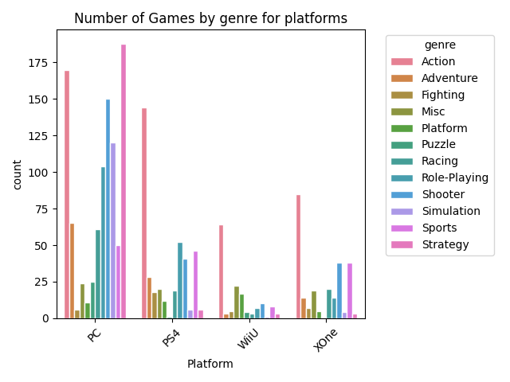

### Task 4 - plotting

Now that our data is ready, we can create the barplot. For this we'll be using the `seaborn` package.

1. Create a function to graph the barplot. [Seaborn documentation.](https://seaborn.pydata.org/generated/seaborn.barplot.html)
2. Feel free to experiment with what you create.
Reference image:
